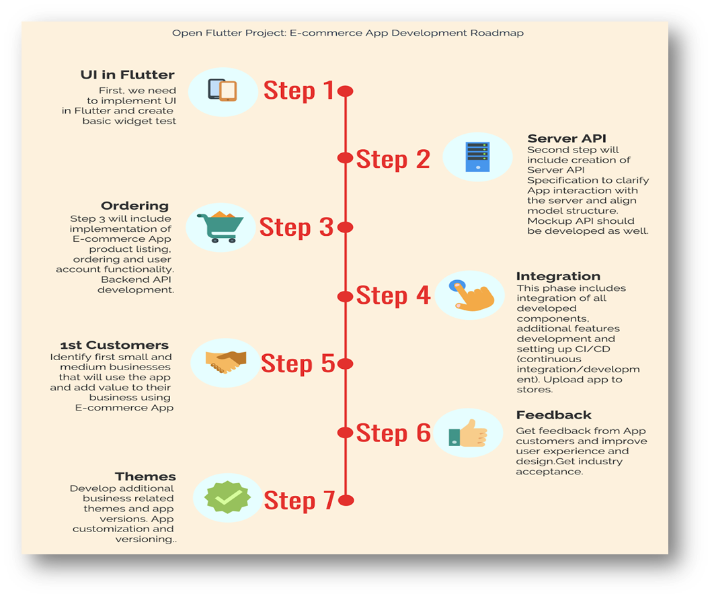

# E-commerce-app
# shopnxt

### Abstract
In recent years it is difficult to develop applications for both IOS and android within
less time. To overcome this, google introduce a new framework called flutter.
It is a new reactive framework and platform for building high-performance and
beautiful mobile apps. It is used extensively at google to build
business-critical apps.

### Introduction
Mobile application development is necessary for most enterprises. When you build your application with both operating systems in mind, try to make judicious use of APIs and understand the specifics of the required developer programs. That approach will help you deliver to your users an app that’s flexible, convenient and lightweight—the perfect way to serve information or services—along with an excellent user experience

### Procedure

